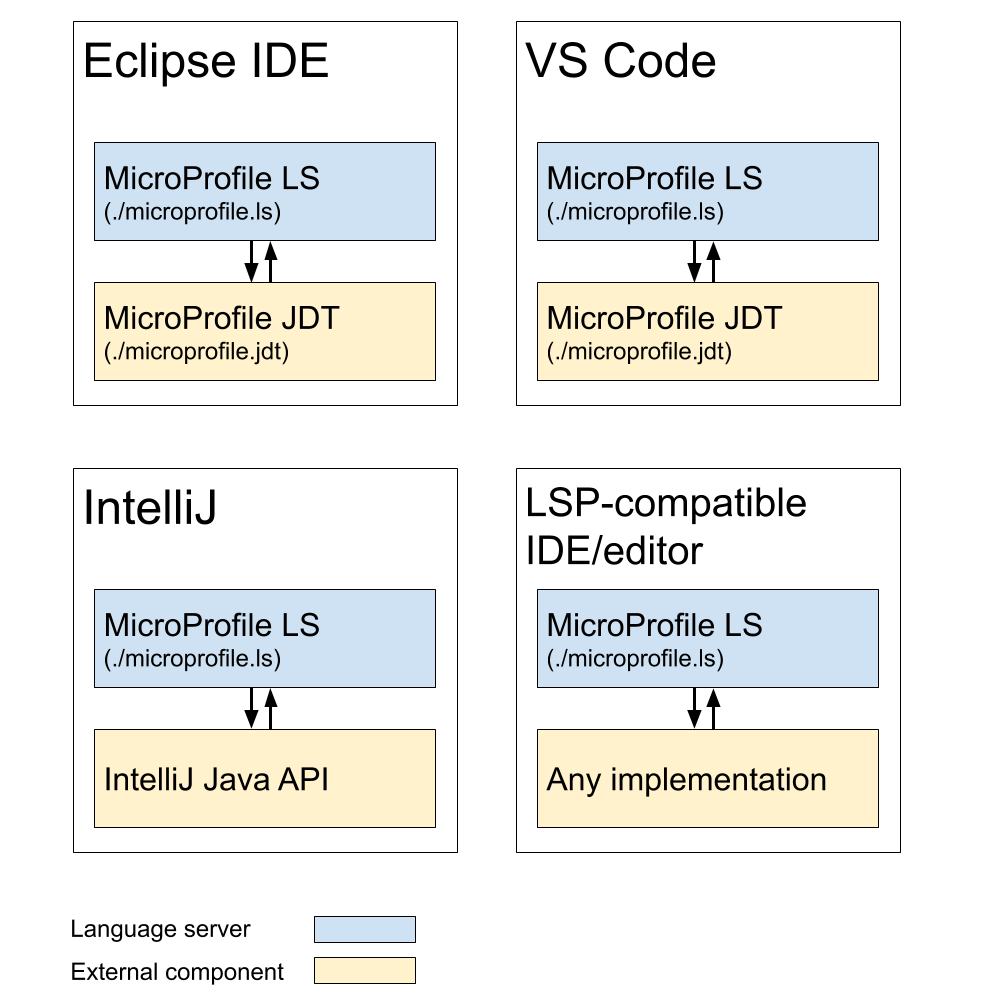

# Architecture

The language features provided by the [MicroProfile Language Server](./microprofile.ls) depend on the dependencies in the user's Java Project.
For example, MicroProfile Fault Tolerance features (snippets, validation, completion, etc.) are only provided if the user's
Java project has MicroProfile Fault Tolerance as a dependency.

In order to avoid duplicating the work done by an IDEs Java Language Support (computing the classpath, rebuilding AST, etc.) the MicroProfile language Server relies on an external component that understands and handles LSP command requests sent from the MicroProfile Language Server.

The MicroProfile Language Server has limited knowledge of the users Java project, and instead uses the external component for information on the Java project. In the context of Eclipse and VS Code, this external component is managed with [MicroProfile JDT](./microprofile.jdt).
The external component does not necessarily require the JDT however, as different implementations can be used instead. For example [Quarkus Tools for IntelliJ](https://github.com/redhat-developer/intellij-quarkus) does not use the JDT and instead has its own implementation based on the [Program Structure Interface](https://jetbrains.org/intellij/sdk/docs/basics/architectural_overview/psi.html) used to handle the requests from [`MicroProfileLanguageClientAPI`](https://github.com/eclipse/lsp4mp/blob/master/microprofile.ls/org.eclipse.lsp4mp.ls/src/main/java/org/eclipse/lsp4mp/ls/api/MicroProfileLanguageClientAPI.java). In other words, the MicroProfile Language Server **does not** depend on JDT.

## microprofile-config.properties language features

For properties completion, the MicroProfile Language Server uses the external component to detect all properties available on the classpath. The external component computes and returns the available properties in the [Spring Boot Configuration Metadata](https://docs.spring.io/spring-boot/docs/current/reference/html/appendix-configuration-metadata.html#configuration-metadata-format) format.

```
{
	"properties": [
		{
			"type": "java.lang.String",
			"extensionName": "microprofile-openapi-api",
			"required": true,
			"name": "mp.openapi.filter",
			"description": "Configuration property to specify the fully qualified name of the OASFilter implementation."
		},
		{
			"type": "boolean",
			"defaultValue": "false",
			"extensionName": "microprofile-openapi-api",
			"required": false,
			"name": "mp.openapi.scan.disable",
			"description": "Configuration property to disable annotation scanning. Default value is `false`."
		}
    ...
	]
}
```

For example:

1. A MicroProfile project is opened and the IDE/editor sends a `textDocument/completion` request after completion has been triggered in the `microprofile-config.properties` file.

2. The MicroProfile Language Server checks if its cache contains a list of available config properties.

- If the cache holds completion options, the MicroProfile Language Server sends them to the IDE as the response to the textDocument/completion request. Communication is complete, and does not proceed to Step 3 and onwards.

- If completion options are not cached, the MicroProfile Language Server uses the [`MicroProfileLanguageClientAPI.java`](https://github.com/eclipse/lsp4mp/blob/master/microprofile.ls/org.eclipse.lsp4mp.ls/src/main/java/org/eclipse/lsp4mp/ls/api/MicroProfileLanguageClientAPI.java) to send a `microprofile/projectInfo` request back to the editor. (Proceed to Step 3)

3. The IDE/editor receives the `microprofile/projectInfo` request and delegates it to the external component. (The [microprofile.jdt](./microprofile.jdt) for Eclipse/VSCode)

4. The external component receives the command in the [MicroProfileDelegateCommandHandler#executeCommand](https://github.com/eclipse/lsp4mp/blob/master/microprofile.jdt/org.eclipse.lsp4mp.jdt.core/src/main/java/org/eclipse/lsp4mp/jdt/internal/core/ls/MicroProfileDelegateCommandHandler.java#L54), computes [project information](https://github.com/eclipse/lsp4mp/blob/master/microprofile.jdt/org.eclipse.lsp4mp.jdt.core/src/main/java/org/eclipse/lsp4mp/commons/MicroProfileProjectInfo.java)(Project URI, the available MP config properties, etc.)

5. The IDE / editor receives the project information and sends it back to the MicroProfile Language Server

6. The MicroProfile Language Server receives the project information, adds it to its cache, and returns the completion options stored in the project information as the response to the original `textDocument/completion` request.

## Java language features

For Java language features (hover, diagnostics, code actions etc.), since the MicroProfile Language Server has limited knowledge of the Java project, it delegates the request to the external component.

For example:

1. A MicroProfile project is opened and the IDE/editor sends a `textDocument/hover` request after the user hovers over a field in a Java file.

2. The MicroProfile Language Server then delegates the request to the external component by sending back a `microprofile/java/hover` request to the client.

3. The client receives the `microprofile/java/hover` request and delegates it to the external component. (The [microprofile.jdt](./microprofile.jdt) for Eclipse/VSCode)

4. The external component receives the command in the [MicroProfileDelegateCommandHandlerForJava](https://github.com/eclipse/lsp4mp/blob/master/microprofile.jdt/org.eclipse.lsp4mp.jdt.core/src/main/java/org/eclipse/lsp4mp/jdt/internal/core/ls/MicroProfileDelegateCommandHandlerForJava.java#L70) and uses information from the JDT to compute any hover results and send them back to the IDE / editor.

5. The IDE / editor receives the hover results and sends it back to the MicroProfile Language Server

6. The MicroProfile Language Server receives the hover results and sends them back as the response to the original `textDocument/hover` request.

The following diagram portrays LSP4MP's integration in various IDEs and editors:


